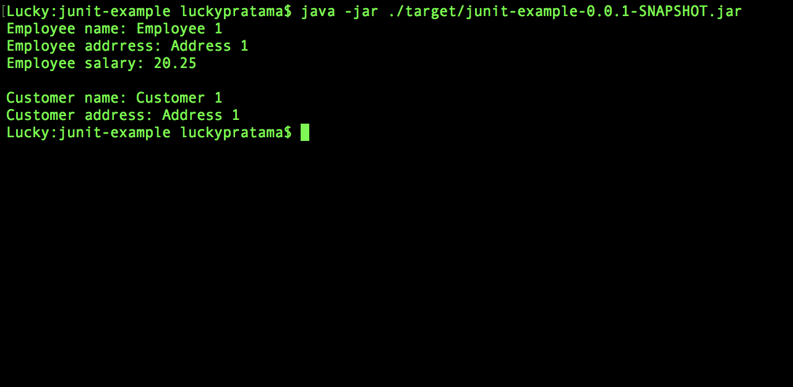
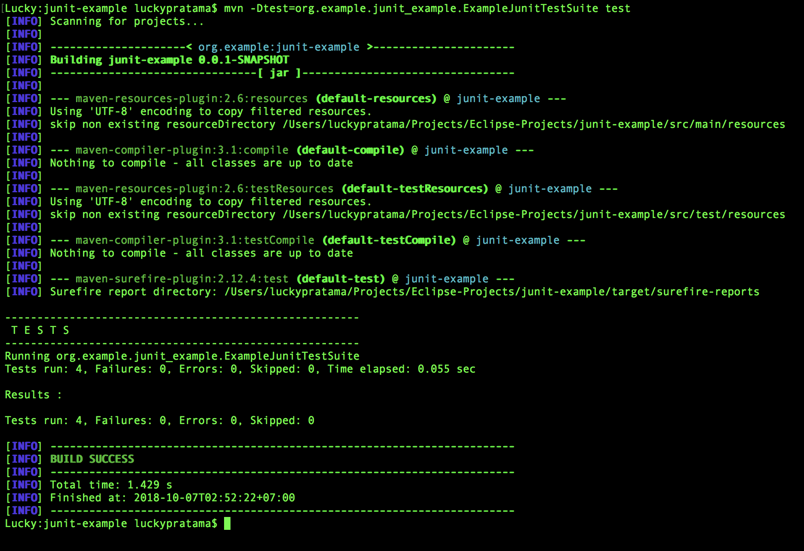
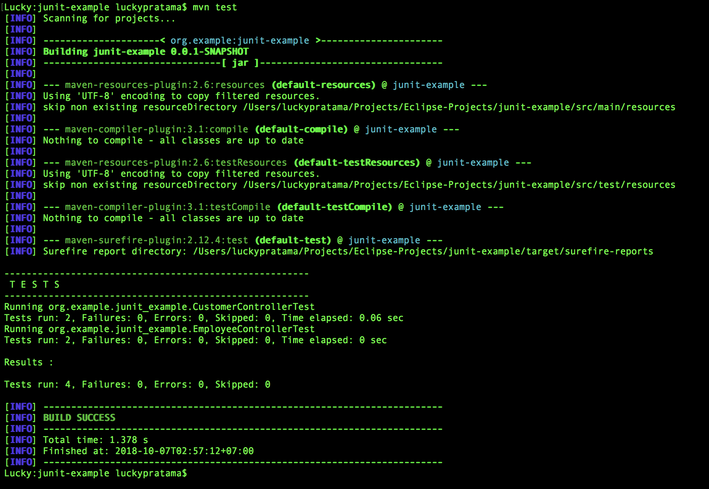
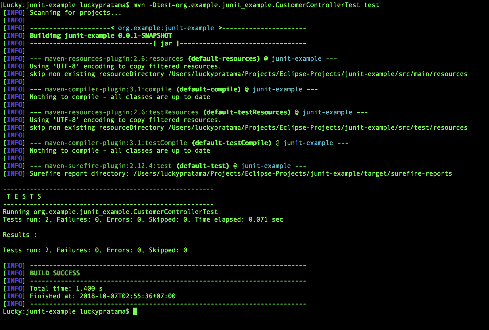
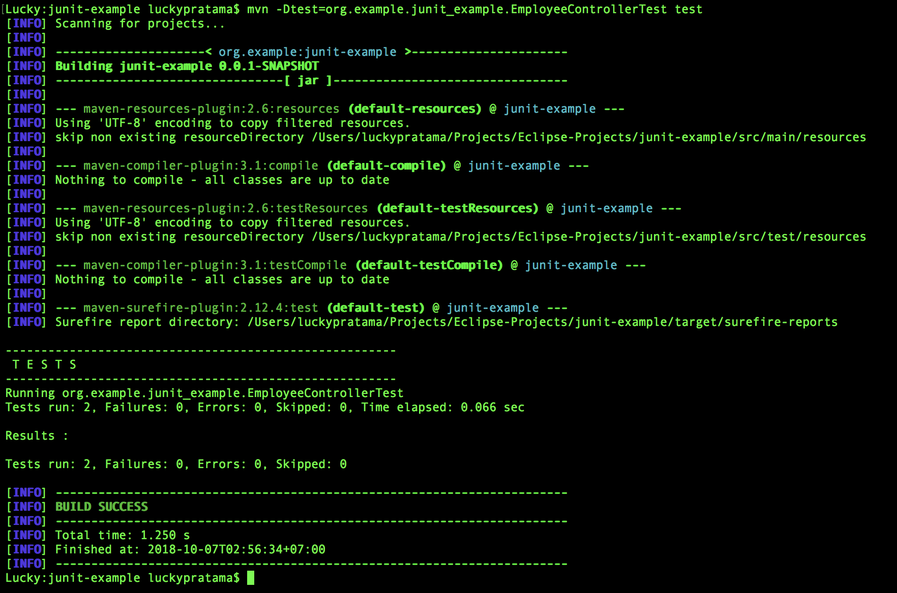

# Java Unit Testing using JUnit Example

## Run jar file
#### Run jar file

## Test Example
### All test screenshots below are for positive scenarios only ( when actual value equals to expected value)

#### Test All Controllers using Test Suite 

#### Test All Controllers 

#### Customer Controller Test

#### Employee Controller Test

